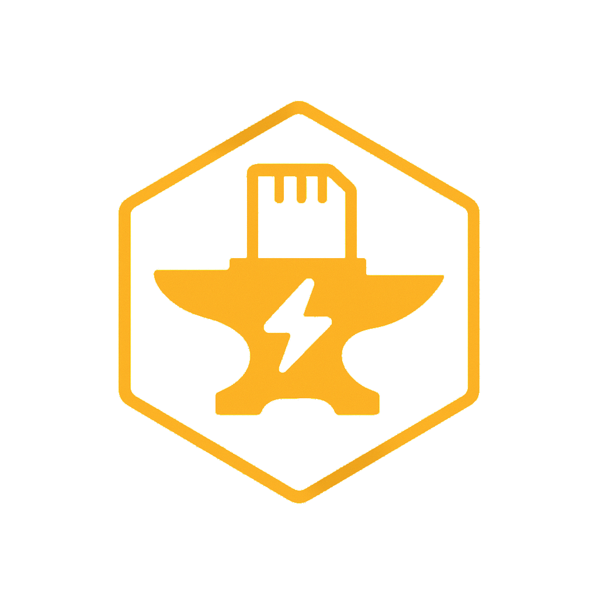

<p align="center">
  
</p>

# imgforge
A web-based wizard for customizing and flashing OS images for Raspberry Pi, Radxa Zero3, and NVIDIA Jetson devices.


Set hostname, Wi-Fi credentials, SSH access, users, Docker, and run custom install scripts inside the image before first boot.

---

## 🚀 Features

- **Modern Web Interface** - React/Next.js UI with Shadcn components
- **Real-time Build Logs** - Live output streaming via WebSocket
- **Rust Backend** - Fast, safe, and efficient API server
- **Flash to SD Cards** - Direct flashing to removable devices
- **Headless Configuration** - Pre-configure Wi-Fi and SSH
- **Expand Filesystems** - Add extra space before flashing
- **Docker Support** - Preload docker-compose projects
- **Custom Scripts** - Run bash scripts inside the image
- **Multiple Platforms** - Raspberry Pi, Radxa Zero3, NVIDIA Jetson

---

## 📦 Installation & Setup

### Option 1: Docker Run (Quick & Simple)

```bash
# Create directories
mkdir -p imgforge/output imgforge/config

# Run the container
docker run -d \
  --name imgforge \
  --privileged \
  -p 3000:3000 \
  -v /dev:/dev \
  -v $(pwd)/imgforge/output:/workdir/output \
  -v $(pwd)/imgforge/config:/workdir/config \
  imgforge:latest
```

Then open http://localhost:3000

### Option 2: Docker Compose (Recommended)

1. **Clone the repository:**
   ```bash
   git clone <repository-url>
   cd imgforge
   ```

2. **Start with Docker Compose:**
   ```bash
   docker-compose up -d
   ```

3. **Access the web interface:**
   ```
   http://localhost:3000
   ```

4. **View logs:**
   ```bash
   docker-compose logs -f
   ```

5. **Stop the service:**
   ```bash
   docker-compose down
   ```

**docker-compose.yml:**
```yaml
version: '3.8'

services:
  imgforge:
    build: .
    container_name: imgforge
    privileged: true
    ports:
      - "3000:3000"
    volumes:
      - /dev:/dev
      - /run/udev:/run/udev:ro
      - ./output:/workdir/output
      - ./config:/workdir/config
    restart: unless-stopped
```

### Option 3: Local Development (No Docker)

**Prerequisites:**
- Rust 1.90+ - Install from [rustup.rs](https://rustup.rs/)
- Node.js 20+ - Install from [nodejs.org](https://nodejs.org/)
- System packages for image manipulation

**Install System Dependencies (Ubuntu/Debian):**
```bash
sudo apt-get update
sudo apt-get install -y \
    curl wget unzip xz-utils \
    qemu-user-static binfmt-support \
    e2fsprogs fdisk parted dosfstools kpartx \
    build-essential pkg-config libssl-dev
```

**Quick Start:**
```bash
# Clone repository
git clone <repository-url>
cd imgforge

# Use the convenience script (starts both backend and frontend)
./start-dev.sh
```

**Access:**
- Backend API: http://localhost:3000
- Frontend Dev: http://localhost:3001

---

## 🔨 Development Setup (Detailed)

### Backend (Rust)

**1. Install Rust:**
```bash
# Install rustup (Rust installer and version manager)
curl --proto '=https' --tlsv1.2 -sSf https://sh.rustup.rs | sh

# Follow the prompts, then restart your shell or run:
source $HOME/.cargo/env

# Verify installation
rustc --version
cargo --version
```

**2. Navigate to backend directory:**
```bash
cd backend
```

**3. Build the backend:**
```bash
# Development build (faster compilation, includes debug symbols)
cargo build

# Release build (optimized, slower compilation)
cargo build --release
```

**4. Run the backend:**
```bash
# Development mode with debug logging
RUST_LOG=debug cargo run

# Release mode
cargo run --release

# Custom port
PORT=8080 cargo run
```

**5. Run tests:**
```bash
cargo test
```

**6. Check code quality:**
```bash
# Format code
cargo fmt

# Run linter
cargo clippy

# Check compilation without building
cargo check
```

**Backend will start on:** http://localhost:3000

**API Endpoints:**
- GET http://localhost:3000/api/health
- GET http://localhost:3000/api/devices
- POST http://localhost:3000/api/build

### Frontend (Next.js)

**1. Install Node.js 20+:**
```bash
# Using NodeSource (Ubuntu/Debian)
curl -fsSL https://deb.nodesource.com/setup_20.x | sudo -E bash -
sudo apt-get install -y nodejs

# Or using nvm (recommended for version management)
curl -o- https://raw.githubusercontent.com/nvm-sh/nvm/v0.39.0/install.sh | bash
nvm install 20
nvm use 20

# Verify installation
node --version  # Should be v20.x.x
npm --version   # Should be v10.x.x
```

**2. Navigate to frontend directory:**
```bash
cd frontend
```

**3. Install dependencies:**
```bash
# Install all npm packages
npm install

# Or use clean install (recommended for CI/production)
npm ci
```

**4. Run the development server:**
```bash
# Start dev server with hot reload
npm run dev

# Custom port
PORT=3001 npm run dev
```

**5. Build for production:**
```bash
# Create optimized production build
npm run build

# Run production build locally
npm run start
```

**6. Run linting:**
```bash
# Check code with ESLint
npm run lint

# Fix auto-fixable issues
npm run lint -- --fix
```

**7. Type checking:**
```bash
# Run TypeScript compiler check
npx tsc --noEmit
```

**Frontend will start on:** http://localhost:3001

**Note:** In development mode, the frontend proxies API requests to the backend at http://localhost:3000

### Running Both Services

**Option 1: Use the convenience script**
```bash
./start-dev.sh
```
This script will:
- Check prerequisites
- Start backend in the background
- Start frontend in the background
- Show logs from both services
- Gracefully shutdown both on Ctrl+C

**Option 2: Manual (two terminals)**

Terminal 1 (Backend):
```bash
cd backend
RUST_LOG=info cargo run
```

Terminal 2 (Frontend):
```bash
cd frontend
npm run dev
```

**Option 3: Using Make**
```bash
# Start both services
make dev

# Or individually
make backend   # Terminal 1
make frontend  # Terminal 2
```

### Development Workflow

**1. Making Backend Changes:**
```bash
cd backend
# Edit src/main.rs or other files
cargo check           # Quick syntax check
cargo clippy          # Check for issues
cargo fmt             # Format code
cargo run             # Run with changes
```

**2. Making Frontend Changes:**
```bash
cd frontend
# Edit app/page.tsx or component files
# Changes auto-reload in browser (hot reload)
npm run lint          # Check for issues
```

**3. Adding Dependencies:**

Backend:
```bash
cd backend
cargo add <package-name>
# or edit Cargo.toml manually
cargo build
```

Frontend:
```bash
cd frontend
npm install <package-name>
# or add to package.json and run npm install
```

**4. Testing Your Changes:**
```bash
# Backend tests
cd backend && cargo test

# Frontend tests (if configured)
cd frontend && npm test

# End-to-end test
curl http://localhost:3000/api/health
```

### Troubleshooting Development Setup

**Backend won't compile:**
```bash
# Clear build cache
cargo clean

# Update Rust
rustup update

# Check Rust version
rustc --version  # Should be 1.90+
```

**Frontend won't start:**
```bash
# Clear node_modules and reinstall
rm -rf node_modules package-lock.json
npm install

# Check Node version
node --version  # Should be v20.x.x
```

**Port already in use:**
```bash
# Find process using port 3000
sudo lsof -i :3000

# Kill the process
kill -9 <PID>

# Or use different ports
PORT=8080 cargo run          # Backend
PORT=3002 npm run dev        # Frontend
```

**Permission errors on Linux:**
```bash
# Add user to disk group (for device access)
sudo usermod -a -G disk $USER

# Re-login or run
newgrp disk
```

---

## 🎯 Usage

### Web Interface

1. **Open the application:**
   ```
   http://localhost:3000
   ```

2. **Configure your image:**

   **Basic Tab:**
   - Select build mode (Create Artifact or Flash to Device)
   - Choose board type (Raspberry Pi/Radxa or Jetson)
   - Set hostname
   - Configure username and passwords
   - Enable SSH

   **Network Tab:**
   - Configure Wi-Fi SSID and password for headless setup

   **Image Tab:**
   - Choose preset image or provide custom URL
   - Expand image size (recommended +2G for Docker)

   **Advanced Tab:**
   - Add Docker Compose content
   - Include custom bash scripts
   - Run inline commands

3. **Build or Flash:**
   - Click "Build Image" to create an artifact in `./output/custom.img`
   - Or select a device and click "Build & Flash" to flash directly

### CLI Usage (Legacy)

You can still use the original bash script:

```bash
./imgforge.sh
```

Follow the interactive prompts to configure and build your image.

---

## 🔧 API Reference

The backend exposes the following REST API endpoints:

| Endpoint | Method | Description |
|----------|--------|-------------|
| `/api/health` | GET | Health check |
| `/api/devices` | GET | List removable devices |
| `/api/build` | POST | Start a build job |
| `/api/flash` | POST | Flash image to device |
| `/api/jobs` | GET | List all jobs |
| `/api/jobs/:id` | GET | Get job status |
| `/api/upload` | POST | Upload files |
| `/api/ws/:job_id` | WS | WebSocket for build logs |

**Example API Call:**
```bash
curl -X POST http://localhost:3000/api/build \
  -H "Content-Type: application/json" \
  -d '{
    "hostname": "mypi",
    "board_type": "raspberrypi",
    "mode": "artifact",
    "enable_ssh": true,
    "wifi_ssid": "MyNetwork",
    "wifi_password": "password123",
    "preset_image": "raspberrypi_lite",
    "expand_image": true,
    "extra_size": "+2G"
  }'
```

---

## 🛠️ Makefile Commands

Use the included Makefile for common tasks:

```bash
# Docker commands
make build          # Build Docker image
make up             # Start containers
make down           # Stop containers
make logs-follow    # Follow container logs
make shell          # Open shell in container

# Development
make dev            # Start dev servers (backend + frontend)
make install        # Install dependencies
make clean          # Clean build artifacts

# Testing
make test           # Run tests
make lint           # Run linters
make format         # Format code

# Utilities
make health         # Check service health
make devices        # List available devices
```

---

## 🏗️ Project Structure

```
imgforge/
├── backend/               # Rust/Axum backend
│   ├── src/
│   │   └── main.rs       # API server & build orchestration
│   └── Cargo.toml        # Rust dependencies
├── frontend/             # Next.js/React frontend
│   ├── app/
│   │   ├── page.tsx      # Main UI
│   │   └── globals.css   # Styles
│   ├── components/ui/    # Shadcn UI components
│   └── public/
│       └── imgforge.png  # Logo
├── imgforge.sh          # Core bash script for image manipulation
├── Dockerfile           # Multi-stage Docker build
├── docker-compose.yml   # Docker Compose configuration
├── Makefile            # Convenience commands
└── README.md           # This file
```

---

## 📡 Configuration Examples

### Wi-Fi Configuration

Wi-Fi is configured by writing `/etc/wpa_supplicant/wpa_supplicant.conf` inside the image:

```conf
ctrl_interface=DIR=/var/run/wpa_supplicant GROUP=netdev
update_config=1
country=US

network={
    ssid="YourSSID"
    psk="YourPassword"
    key_mgmt=WPA-PSK
}
```

### Docker Compose Example

Add a docker-compose.yml to your image:

```yaml
version: '3'
services:
  web:
    image: nginx:latest
    ports:
      - "80:80"

  app:
    image: node:20-alpine
    volumes:
      - ./app:/app
    working_dir: /app
    command: npm start
```

### Custom Install Script

Add a bash script to run inside the image:

```bash
#!/bin/bash
apt-get update
apt-get install -y vim git htop
systemctl enable docker
```

---

## 🎯 Supported Platforms

### Board Types
- Raspberry Pi 3/4/5
- Radxa Zero 3W
- NVIDIA Jetson Nano
- NVIDIA Jetson Xavier NX
- NVIDIA Jetson AGX Orin

### Preset Images
- Raspberry Pi OS Lite (64-bit)
- Radxa Zero3W Ubuntu 22.04 LTS Desktop
- Radxa Zero3W Ubuntu 22.04 LTS Server
- Custom images via URL

---

## 🐛 Troubleshooting

### Container won't start
```bash
# Check logs
docker-compose logs

# Ensure directories exist
mkdir -p output config

# Rebuild
docker-compose build --no-cache
docker-compose up -d
```

### No devices detected
- Ensure container is running in **privileged mode**
- Verify `/dev` is mounted: `docker inspect imgforge | grep /dev`
- Check device on host: `lsblk`

### Build fails
- Check available disk space: `df -h`
- View build logs in the web interface
- Verify imgforge.sh has execute permissions: `chmod +x imgforge.sh`

### Port 3000 already in use
```bash
# Find what's using the port
sudo lsof -i :3000

# Change port in docker-compose.yml
ports:
  - "8080:3000"  # Use port 8080 instead
```

---

## 🔒 Security Considerations

- **Privileged Mode**: Required for device access and image manipulation
- **Device Access**: Full `/dev` access needed for SD card flashing
- **Passwords**: Avoid committing config files with passwords
- **Production**: Use HTTPS and authentication when exposing to network
- **Firewall**: Restrict access to trusted networks only

---

## 📝 License

See [LICENSE](LICENSE) file for details.

---

## 🤝 Contributing

Contributions are welcome! Please feel free to submit a Pull Request.

1. Fork the repository
2. Create your feature branch (`git checkout -b feature/amazing-feature`)
3. Commit your changes (`git commit -m 'Add amazing feature'`)
4. Push to the branch (`git push origin feature/amazing-feature`)
5. Open a Pull Request

---

## 📧 Support

For issues and questions, please use the GitHub issue tracker.

---

<p align="center">Made with ❤️ for the embedded Linux community</p>
